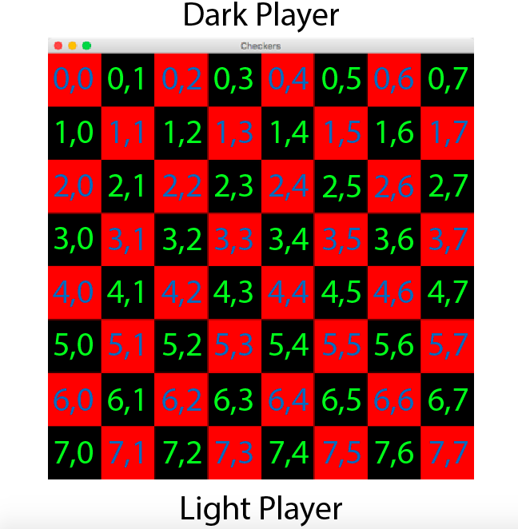

# Checkers Data Model

### Objects
* CheckerPiece
* CheckerSpot
* Player
* CheckerType
* Board


### CheckerPiece Class
This is used to create an object for each checker piece. It has a color and its position on the board. Each piece will be put in an ArrayList in the board class.
```java
class CheckerPiece {
    private CheckerType type;
    private Point position;

    public void setType(CheckerType type) {
      this.type = type;
    }
    public void setPosition(Point point) {
      this.point = point;
    }
    public CheckerType getType() {
      return type;
    }
    public Point getPosition() {
      return point;
    }
}
```
### CheckerSpot Class
A checker spot can hold a checker or be empty. The board is populated with this object through an ArrayList.
```java
public class CheckerSpot {
  CheckerPiece checker = null;
  private boolean isEmpty = true;

  protected void setOccupied() {
    isEmpty = false;
  }
}
```
### CheckerType Enum
Added to give the checker piece a color/to differentiate between a king piece and a regular piece.
```java
public enum CheckerType {
    BLACK,
    BLACK_KING,
    RED,
    RED_KING
}
```
### Player Class
This object stores the information associated with the player. A player can be human or computer. The player must also have a certain checker color and number of checker pieces associated with them.
```java
class Player {
    private String name;
    boolean isHuman;
    CheckerType color;
    private int numberOfPieces = 12;

    public void setName(String name);
    public String getName();
    public int getPiecesLeft();
    public void setPiecesLeft();
}
```
### Board Class
This is the checker board data. It is responsible for assigning pieces to an ArrayList similar to the picture below. Each CheckerPiece is assigned to a certain __Point__ (x,y) position and the remainder of spots in the grid are to be assigned as a checkerSpot that is empty(null).


The class is also responsible for declaring a winner(all pieces are taken) or draw (no moves possible) through __declareWinner__. __isLegalMove__ checks if the currently selected checker piece can move to a certain position. The __Board__ constructor instantiates the __Player__ object to set each player's attributes.
```java
class Board {
    private ArrayList<CheckerSpot> checkerSpots;
    private int numRows;
    private int numCols;
    private double boardWidth;
    private double boardHeight;

    public Board(int numRows, int numCols, double boardWidth, double boardHeight) {
        this.numRows = numRows;
        this.numCols = numCols;
        this.boardWidth = boardWidth;
        this.boardHeight = boardHeight;
        Player player1 = new Player();
        Player player2 = new Player();
    }      

    private void assignPieces(ArrayList<CheckerSpot> checkerSpots, int numRows, int numCols);
    public void declareWinner(Player player1, Player player2);
    public boolean isLegalMove(ArrayList<checkerSpot> checkerSpots, int row, int column);

}
```
